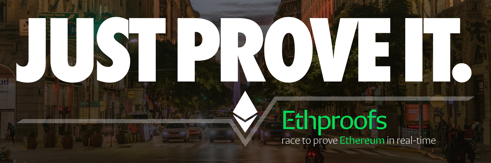

# Ethproofs — Project Management (PM)

This repository hosts the **Product Requirements Document (PRD)** for Ethproofs v3 and the **project board** we use to plan and track work. Use this repo for specs, milestones, and cross-repo coordination.

---

## Quick links

- 📄 **PRD (Ethproofs v3):** [`PRD.md`](./PRD/PRD.md)  
  _Purpose:_ Defines the vision, scope, features, verification guardrails, success metrics, and long-term roadmap for Ethproofs. Treat it as the single source of truth for product decisions and acceptance criteria.

- 🗺️ **Project Board:** [Ethproofs V3 Board](https://github.com/orgs/ethproofs/projects/2)  
  _Purpose:_ Plan, prioritize, and track deliverables across phases (spec, design, implementation, verification, docs).  
  **Columns:** Ideas → Spec’ing → In Progress → In Review → Verified → Done  
  _(TODO: adjust link/columns if your board differs.)_

---

## What lives here

- `PRD.md` — canonical product spec (vision, principles, verification & QA, success metrics, long-term vision).
- `docs/` — supporting specs (design tokens, schemas, onboarding forms, glossary).  
  - `docs/terms-and-metrics.md`
  - `docs/data-schemas.md`
  - `docs/onboarding-forms.md`
  - `docs/design-system.md`

> Tip: Keep deep technical discussions in the implementation repos; link threads back here from the PRD or board cards.
